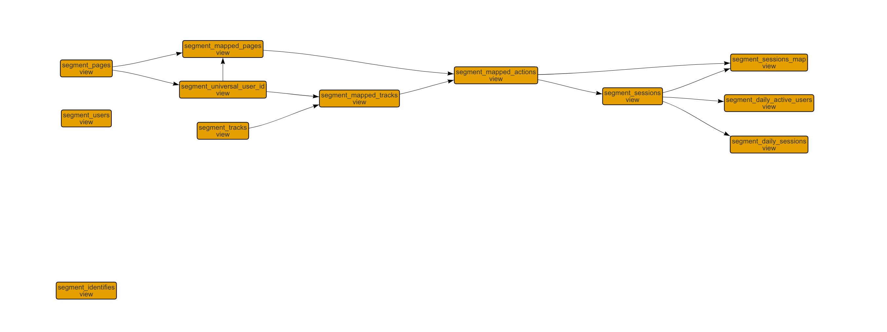

### Segment DBT Data Models

---

### Models
The primary data models contained in this package are described below. While other models exist,
thse are the models primarily used to build the three primary models listed here.

These models can be used to build other custom models to fit your use case.

| model | description |
|-------|-------------|
| segment\_universal\_user_id | Contains the cononical mapping of many anonymous ids to a single universal id per user. |
| segment\_mapped\_pages | Contains the Segment 'pages' table with the universal id mapped to each record. |
| segment\_mapped\_events | Contains the Segment 'tracks' table with the universal id mapped to each record. |
| segment\_mapped\_actions | Contains the union of the 'segment\_mapped\_pages' model and 'segment\_mapped\_events' model. |
| segment\_sessions | Contains the start and end of each user session and session id. |
| segment\_sessions\_map | Contains the 'segment\_mapped\_actions' model with session ids mapped to each track or page call. |


#### Model Graph


#### How You Might Use These Models

These "foundational" models can be used to calculate aggregrated statistics or branched out to create new complex models.

For example, the _segment_sessions_ model can be used to calculated statistics like monthly active users (MAUs), daily active users (DAUs), weekly active users (WAUs), and more.

An example of branching out these models for more complex or specific analysis might include using the _segment_mapped_actions_ model to better understand key events that lead to purchases (inversely, funnel dropout).

### Installation
1. Add the following lines to the bottom of your `dbt_project.yml` file:
```YAML
repositories:
  - https://github.com/jgooly/segment.git
```

2. Run `dbt deps`.

### Configuration
The base [variables](http://dbt.readthedocs.io/en/master/guide/context-variables/#arbitrary-configuration-variables) needed to configure this package are as follows:

| variable | information | required |
|----------|-------------|:--------:|
|segment.pages|The Segment _pages_ table in warehouse (usually something like _segment.pages_).|Yes|
|segment.tracks|The Segment _tracks_ table in warehouse (usually something like _segment.tracks_).|Yes|
|segment.users|The Segment _users_ table in warehouse (usually something like _segment.users_).|No|
|segment.identifies|The Segment _identifies_ table in warehouse (usually something like _segment.identifies_).|No|
|segment.adwords.campaign\_performance\_report|The Segment ETL'd AdWords table in warehouse (usually something like _adwords.campaign\_performance\_report_). The Segment AdWords integration must be enabled in Segment. **This is a work in progress**.|No|

An example of the `dbt_project.yml` file:

```yml
# dbt_project.yml

...

models:  
  segment:
    enable: true
    materialized: view
    analytics:
      materialized: view
    utility_models:
      materialized: view
    adwords:
      enable: false
      vars:
        "segment.adwords.campaign_performance_report": "adwords.campaign_performance_report"
    base:
      materialized: view
      vars:
        "base.pages" : "segment.pages"
        "base.tracks" : "segment.tracks"
        "base.users" : "segment.users"
        "base.identifies" : "segment.identifies"

...

repositories:
 - https://github.com/jgooly/segment
```

### Database Support
These models were written and tested for Redshift only.

### Contributions
Additional contributions to this repo are very welcome!
Please submit PRs to master.
All PRs should only include functionality that is contained within all
Segment deployments; no implementation-specific details should be included.

---

### Want to Know More About DBT?
- [What is dbt](https://dbt.readme.io/docs/overview)?
- Read the [dbt viewpoint](https://dbt.readme.io/docs/viewpoint)
- [Installation](https://dbt.readme.io/docs/installation)
- Join the [chat](http://ac-slackin.herokuapp.com/) on Slack for live questions and support.
